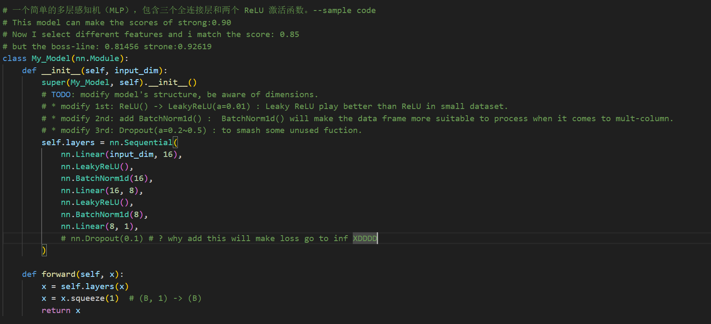
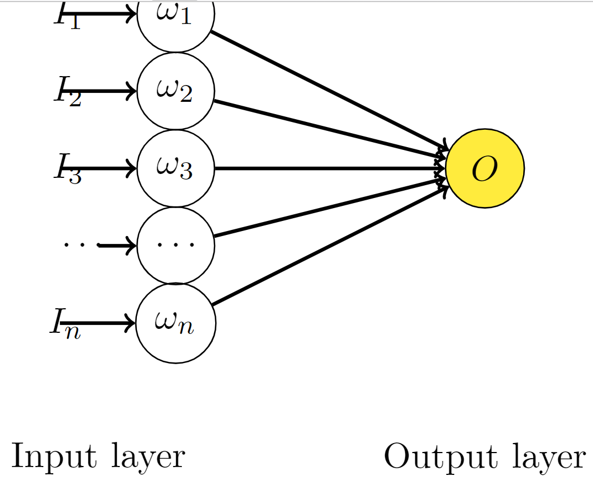

## 机器学习中的Dropout+BN操作为什么有时候会导致训练结果变差

### Pre: 机器学习认为神经网络拟合的结果有用的原因是相信训练集和测试集独立同分布。
#### 1.Dropout 层

相关链接:[The magic of NO dropout](https://www.kaggle.com/competitions/commonlitreadabilityprize/discussion/260729)

在做 Lihongyi_HW1 时，我尝试了 dropout 层，但是发现只要添加后就会让 Loss 跑飞，详细如下：

那么我的结果就是：

但是在这个分类任务中，我发现 dropout 层可以很好的防止过拟合，并且可以显著提高准确率，详细请看模型结构中的 FC 全连接层。

note：NN.regression task and NN. classification are different.

###### Dropout 的数学原理

考虑简单的线性神经网络:

可以看出他的输出为:

$$
O = \sum_{i}^n w_i I_i
$$

对于无 Dropout 的网络，如果 t 是目标值:

$$
E_{N}=\frac{1}{2}\left(t-\sum_{i=1}^{n} w_{i}^{\prime} I_{i}\right)^{2}
$$

$\omega'$ 是为了找到之后要介绍的加入 Dropout 的网络的关系，其中 $\omega'=p\omega$ 。

$$
E_N = \frac{1}{2}\left(t-\sum_{i=1}^{n} p_i w_{i} I_{i}\right)^{2}
$$

$$
\frac{\partial E_{N}}{\partial w_{i}}=-t p_{i} I_{i}+w_{i} p_{i}^{2} I_{i}^{2}+\sum_{j=1, j \neq i}^{n} w_{j} p_{i} p_{j} I_{i} I_{j}
$$

当我们添加 Dropout 之后可知：假设丢失率$\delta \sim \text{Bernoulli}(p) $服从伯努利分布，即它有 p 的概率值为 1 ， 1-p 的概率值为 0 。
那么

$$
E_{D}=\frac{1}{2}\left(t-\sum_{i=1}^{n} \delta_i w_{i} I_{i}\right)^{2}
$$

$$
\frac{\partial E_{D}}{\partial w_{i}}=-t \delta_{i} I_{i}+w_{i} \delta_{i}^{2} I_{i}^{2}+\sum_{j=1, j \neq i}^{n} w_{j} \delta_{i} \delta_{j} I_{i} I_{j}
$$

$$
\begin{aligned} E\left[\frac{\partial E_{D}}{\partial w_{i}}\right] &=-t p_{i} I_{i}+w_{i} p_{i}^{2} I_{i}^{2}+w_{i} \operatorname{Var}\left(\delta_{i}\right) I_{i}^{2}+\sum_{j=1, j \neq i}^{n} w_{j} p_{i} p_{j} I_{i} I_{j} \\ &=\frac{\partial E_{N}}{\partial w_{i}}+w_{i} \operatorname{Var}\left(\delta_{i}\right) I_{i}^{2} \\ &=\frac{\partial E_{N}}{\partial w_{i}}+w_{i} p_i \left(1 - p_{i}\right) I_{i}^{2} \end{aligned}
$$

我们可以看出，在 $\omega'=p\omega$的前提下，带有 Dropout 的网络的梯度的期望等价于带有正则的普通网络。换句话说，Dropout 起到了正则的作用，正则项为$ w _ i p_i \left(1 - p _ {i}\right) I_i^{2}$ 。

###### 那么为什么会这样呢？

> 没有添加 Dropout 的网络是需要对网络的每一个节点进行学习的，而添加了 Dropout 之后的网络层只需要对该层中没有被 Mask 掉的节点进行训练。
> 也就是说，Dropout 层添加后改变了输出的方差，而不改变输出的均值。

考虑$d \sim \text{Bernoulil}(p)$，那么对于输入的随机变量$h$有：
$$h'=\frac{1}{p}dh$$
均值：
$$E(h')=\frac{1}{p}E(d)\cdot \mu_h=\mu_h$$
方差：
$$Var(h')=E(h'^2)-E(h')^2=\frac{1}{p^2}E(d^2)E(h^2)-\mu_h^2=\frac{1}{p}E（h^2）-\mu_h$$
那么到了这一步，我们就可以知道 dropout 会导致样本分布的整体偏移，在经过 RELU 非线性层的处理后，最终导致整个网络输出结果的偏移。训练结果（权重$\omega$与偏移标量$b_{\text{bias}}$）会适合于 dropout 后的训练内容，而在未经过 dropout 的验证集中就不适合。

回归任务中的评价函数一般都是loss，所以不适合添加dropout层。
但是对于分类任务，输出结果是类别判断，往往是输出的一个范围值划分为一类，所以几乎不受影响。
#### 2. BN层:
参考链接:[什么是BatchNorm](https://www.zhihu.com/question/38102762/answer/85238569)

添加batchNorm是有效的。

###### batchnorm 的数学原理（推导就是chain rule 不详细写了）

###### 那么为什么会这样呢？
> $\operatorname{BatchNorm1d}(\mathbf{h}_{i}) $
批量归一化通过对 mini-batch 中的数据进行标准化来定中间层的分布。
规定$m=\text{batch}$,$\gamma$与$\beta$为可学习参数。

批量归一化公式如下：
         $$ \mu _{\text{batch}} = \frac{1}{m} \sum _{i=1}^{m} x_i $$
         $$ \sigma _{\text{batch}}^2 = \frac{1}{m} \sum _{i=1}^{m} (x_i - \mu _{\text{batch}})^2 $$
         $$ \hat{x}_i = \frac{x_i - \mu_{\text{batch}}}{\sqrt{{\sigma}_{\text{batch}}^2 + \epsilon}} $$
         $$ y _{i} = \gamma \hat{x} _{i} + \beta $$

###### batchnorm+Dropout效果
省流答案是会变差的，因为两者会导致验证集的方差不同。

