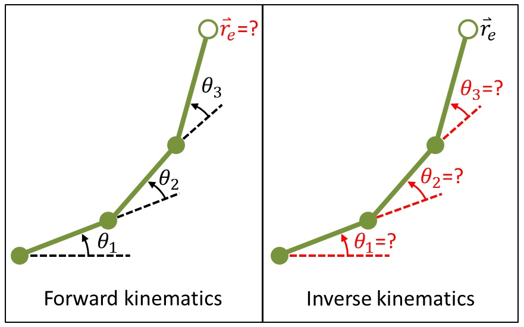

# 使用雅可比矩阵求解机械臂运动学逆解算问题

在这个以及后面的一些博客里，我们将会讲解运动学逆解算问题(IK问题)-当然，大部分是使用雅可比矩阵来求解的。尽管这个方法应该有许多计算，但是我们可以仅仅把必要的理论展示出来；不需要多少计算，只要一些微积分、矩阵运算、矢量叉乘等运算方式的知识，我们就可以进入讲解了。（当然，还需要理解一些欧式变换的矩阵形式，比如平移，旋转，仿射变换等）

首先，我们在这一页会讲解基础的运动学正解算和逆解算的式子，然后下一页我们会讨论一些雅可比矩阵的意义（比如雅可比矩阵的逆）来解决这些问题。

## 所以什么是运动学逆解算问题?

广义上来说，可以参考论文[Inverse Kinematics: a review of existing techniques and introduction of a new fast iterative solver](https://www.researchgate.net/publication/273166356_Inverse_Kinematics_a_review_of_existing_techniques_and_introduction_of_a_new_fast_iterative_solver)。

也就是说，IK问题能够让物体从一个位置移动到另一个位置。比如你想拿起桌子上的一杯水，你的大脑就会解算一系列抽象的运动学逆解问题：比如如何移动你的肩关节，肘关节，和手腕来让你的手到达水杯所在的位置。

在机器人运动学中，机械臂的控制就需要这一系列运动学逆解算。这里的IK问题，指的是Inverse Kinematics问题，正好是Forward Kinematics问题的逆命题。

假如我们有一个2D平面内的多连杆机械臂并由许多可旋转的关节组成，终端为机械夹爪或者其他操作工具（比如铣刀等）。

同时假设每一个机械臂关节的关节角 $\theta_i$ 和杆长 $L$ 最终就能计算得出终端位置 $\mathbf{r}_e$ 。 这就是运动学正向问题(Forward Kinematics).

那么同理，你应该可以很容易得出运动学逆解算(Inverse Kinematics):已知终端位置 $\mathbf{r}_e$ 应该如何计算出每一个关节角 $\theta_i$ 来达到终端位置。

易知，运动学正解问题(FK问题)只有一个解(unique solution)，但是运动学逆解算(IK问题)一般就不只有一个解(Many solutions)。

由于对称性，我们就可以到达相同的位置有许多不同的解法，这样我们就会得到多解问题。下面我们就将数学描述一下机械臂，建立相关的数学模型:

# 定义坐标系中的机械臂
我们机械臂中有许多旋转的部分，那么我们自然想到为每个关节定义一个坐标系:

这种情况下，我们每一个关节都是自己坐标系下的远点，那么$X1Y1$这个坐标系就是第一个关节的坐标系， $X_1$沿着$L_1$方向，同时第一个坐标系旋转了 $\theta_1$ 角度，此后每个坐标系相同，不难有$X_iY_i$长度$L_i$，旋转了$\theta_i$。

接下来我们定义世界坐标系(Global coordinate system)$X_0Y_0$，随后由欧式坐标变换矩阵可以得出:

$${}_0^3P={}_0^1T{}_1^2T{}_2^3T P_0$$

其中由矩阵变换不难有:

$$[{}^1_0 T]=\begin{bmatrix}\cos\theta_1&-\sin\theta_1&0&x_0\\
\sin\theta_1& \cos\theta_1&0&y_0\\
0&0&1&0\\
0&0&0&1
\end{bmatrix}$$
$$
[{}^1_0 T]=\begin{bmatrix}
\cos\theta_1 &-\sin\theta_1 & 0& L_1\\
\sin\theta_1& \cos\theta_1&0 &0\\
0&0&1&0\\
0&0&0&1
\end{bmatrix}
$$
$$
[{}^1_0 T]=\begin{bmatrix}\cos\theta_1&-\sin\theta_1&0&L_2\\
\sin\theta_1& \cos\theta_1&0&0\\
0&0&1&0\\
0&0&0&1
\end{bmatrix}
$$
$$
[P_0]=\begin{bmatrix}L_3 &0 &0 &1\end{bmatrix}^T
$$
最终有结果:$\mathbf{r}_e=[{}^1_0 T][{}^2_1 T][{}^3_2 T][P_0]$
# 雅可比矩阵前置

我们目标是为了确定终端位置如何从一个位置$\mathbf{r}_e$移动到另一个位置$\mathbf{r}_t$，那么我们就有了一个微小的$\Delta\mathbf{r}=\mathbf{r}_e-\mathbf{r}_t$，这样我们就可以引入雅可比矩阵来进行后面的的求解(其实也就是用每个关节角的改变$\Delta \theta来进行终端位置的仿真)$了。
# 雅可比矩阵
雅可比矩阵可以用来处理多变量函数的斜率，使用矩阵形式；当然，雅可比矩阵很自然的会有如下构造:
$$\mathbf{\Delta}\mathbf{r}=\mathbf{J}\mathbf{\Delta}\mathbf{\theta}$$
但是$\mathbf{J}$到底代表什么呢?在三维平面内，雅可比矩阵是一个$3\times n$ 的矩阵，n代表机械臂的个数:

这个矩阵表示了机械臂末端位置坐标(x,y,z)关于每一个机械臂的关节角的变化。
那么我们有:

$$\Delta \overrightarrow{r}=\left\{ \begin{matrix}\Delta x \\ \Delta y \\ \Delta z\end{matrix}\right\}=\begin{bmatrix}\frac{\partial x}{\partial \theta_1} &\frac{\partial x}{\partial \theta_2} &\cdots &\frac{\partial x}{\partial \theta_n}\ \\\frac{\partial y}{\partial \theta_1} &\frac{\partial y}{\partial \theta_2} &\cdots &\frac{\partial y}{\partial \theta_n}\ \\\frac{\partial z}{\partial \theta_1} &\frac{\partial z}{\partial \theta_2} &\cdots &\frac{\partial z}{\partial \theta_n} \end{bmatrix}\left\{ \begin{matrix}\Delta \theta_1 \\ \Delta \theta_2\\\vdots \\ \Delta \theta_n\end{matrix}\right\}=\left\{ \begin{matrix}\frac{\partial x}{\partial \theta_1}\Delta\theta_1 &\frac{\partial x}{\partial \theta_2}\Delta\theta_2 &\cdots &\frac{\partial x}{\partial \theta_n}\Delta\theta_n \\\frac{\partial y}{\partial \theta_1}\Delta\theta_1 &\frac{\partial y}{\partial \theta_2}\Delta\theta_2 &\cdots &\frac{\partial y}{\partial \theta_n}\Delta\theta_n \\\frac{\partial z}{\partial \theta_1}\Delta\theta_1 &\frac{\partial z}{\partial \theta_2}\Delta\theta_2 &\cdots &\frac{\partial z}{\partial \theta_n}\Delta\theta_n\end{matrix}\right\} $$

另一种解释为: 这个雅可比矩阵运算的结果表示每一个机械臂的终端位置，比如下图中第一个，这个也就是$\theta_1$的影响；下图所有的虚线分别表示改变$\theta_i$导致末端位置的改变，箭头表示后面机械臂整体运算出的结果(可以视为这一个机械臂连杆旋转所经过的轨迹)。

不难发现，只要我们对终端位置(x,y,z)取关于每个关节角度$\theta_i$的微分，那么我们最终属于是线性化了这个问题（也就是说，你只需要解一个线性方程组即可）。但是，这种方法因为所取为微分，所以对于较大角度的改变可能不是那么精确。

那么我们应该如何得出雅可比矩阵的每个元素呢？，一种方式是通过欧式坐标变换矩阵来得到一个终端位置(x,y,z)关于每个关节角$\theta_i$的函数:$\mathbf{r}_e=f(\mathbf{\theta})=f(\theta_1,\theta_2,\theta_3,\cdots,\theta_n)$，这个式子我们已经在前面写出过了。

那么另一种方法就是通过叉乘:
$$\frac{\partial \mathbf{r_e}}{\partial \theta_j}=\mathbf{a_j}\times (\mathbf{r_e}-\mathbf{r_j})$$
这里的$\theta_j,\mathbf{r_j}$表示第j个关节的夹角与位置，$\mathbf{a_j}$表示这个关节轴的旋转矢量。

那么如果这么定义:
$$\mathbf{J}=\left[\begin{matrix}{\mathbf{a_1}\times (\mathbf{r_e}-\mathbf{r_1})}^T &{\mathbf{a_2}\times (\mathbf{r_e}-\mathbf{r_2})}^T&{\mathbf{a_3}\times (\mathbf{r_e}-\mathbf{r_3})}^T &\cdots &{\mathbf{a_n}\times (\mathbf{r_e}-\mathbf{r_n})}^T\\ \end{matrix}\right]$$
对于二维XY平面内的机械臂，旋转矢量始终指向Z轴方向，因此，我们旋转矢量$\mathbf{a_j}=\alpha \hat{k}$

那么为了构造这种雅可比矩阵，我们需要使用一些求逆方法；当然，大部分雅可比矩阵都不是平方项，所以大部分不可逆；为了避免求逆问题的存在，我们需要使用广义逆-伪逆矩阵(当然我们不讲述这个，只是用来保证一定可以求逆即可)。

我们通过逆矩阵就能写出:
$$\mathbf{J}^{-1}\mathbf{\Delta}\mathbf{r}=\mathbf{\Delta}\mathbf{\theta}$$
根据这个式子我们就不难得出每个关节角角度。

# 补充
雅可比矩阵这里写下的$3\times n$的形式其实是简化后的，这个形式一般只是用来得出终端位置。如果我们需要机械臂的终端位置与终端朝向，那么我们要使用$6\times n$的形式，其中第4，5，6三行应该表示机械臂终端关于X,Y,Z轴旋转的过程。

当然，我们就可以给出映射关系(相应的眼科比矩阵的第i列表示):
$$\mathbf{J_i}=\left\{\begin{matrix}\begin{bmatrix}{}^BZ_i\\0\end{bmatrix}&,i为移动关节\\\begin{bmatrix}{}^BZ_{i}\times ({}^B_iR^{i}p_n)\\{}^BZ_{i}\end{bmatrix}&,i为旋转关节\end{matrix}\right.$$
对于移动关节:$Z_i$表示第i个坐标系中Z轴单位向量在基坐标系{0}中的表示。
对于转动关节:${}^BZ_{i-1}$表示是坐标系{i}的z轴单位向量在基座标系{0}中的表示。
$p_{in}^0={}^B_iR^ip_n$表示末端坐标原点相对坐标系{i}的位置矢量在基座标系{0}中的表示。