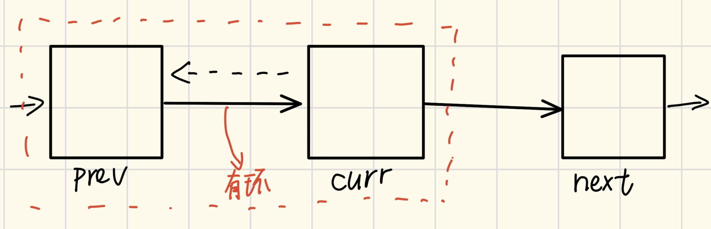

## leetcode【链表】刷题有感
[链表标签](https://leetcode.cn/problemset/?page=1&topicSlugs=linked-list)在 leetcode 一共有 「110 道题」。

相对常见的链表结构：
```plaintext
interface ListNode<T> {
  data: T;         // 数据域，存放数据。
  next: ListNode;  // 指向下一个节点的指针。
  pre : ListNode;  // 指向上一个节点，单链表没有。
}
```
> 当然，本文主要基于C语言以及单向链表撰写。如果你把链表叫成是单叉树的话。
#### 基本操作以及时间复杂度
###### 添加节点(尾插入)/插入节点
假如现在的节点为head->node1->node2->node3->NULL;
现插入新建节点node4到node3后(尾插)且各指针已给定($T(n)=O(1)$):
```c
struct ListNode *node4 = NULL;
node3->next = node4;
node4->next = NULL:
```
假设有节点p需要插入到node2与node3之间且指针未给出($T(n)=O(n)$):
先遍历节点找到待插入位置的前置节点。
```c
struct ListNode *tmp = node2->next;
node2->next = p;
p->next = tmp;
```
###### 查找节点/修改节点(dfs遍历)
首先肯定是要遍历,其次无论是值比较还是索引查找，都需要$O(n)$
```c
for (struct ListNode *cur = head; cur != null; cur = cur.next,i++) {
    if(cur.val==target||i==id)
    {return cur;}
}
```
###### 删除节点
假如现在的节点为head->node1->node2->node3->NULL;
删除node2节点:
未给出指针需要先遍历节点找到待删除位置的前置节点($O(n)$)。
```c
node1->next = node1->next->next;
```
#### 做题技巧
新手多画图！下面是一些常见的操作技巧:
###### 快慢指针

###### 虚拟头

###### 穿针引线

###### 先排再穿后判空

#### 题目类型

###### 环

###### 边界

###### 前后序

###### 修改指针
比如[链表翻转](https://leetcode.cn/problems/reverse-linked-list/):
常见的迭代版本为：

考虑prev->curr结构，如果curr->next=prev会导致next丢失，所以储存next=curr->next，此后curr->next,prev->next依次迭代即可。
```c
struct ListNode* reverse(struct ListNode* head) {
    struct ListNode* prev = NULL;
    struct ListNode* curr = head;
    while (curr) {
        struct ListNode* next = curr->next;
        curr->next = prev;
        prev = curr;
        curr = next;
    }
    return prev;
}
```
当然我们还有递归版本的:
考虑$n_1,n_2,\cdots,n_{i-1},n_{i},n_{i+1},\cdots,n_k,\phi$结构，我们易得:
$$n_i.\text{next}.\text{next}=n_i$$
这一递推关系，可以写出下面的代码
```c
struct ListNode* reverse(struct ListNode *head)
{
        if (head == NULL || head->next == NULL)
        return head;
    struct ListNode* new = reverseList(head->next);
    head->next->next = head;
    head->next = NULL;
    return new;
}
```


###### 拼接链表